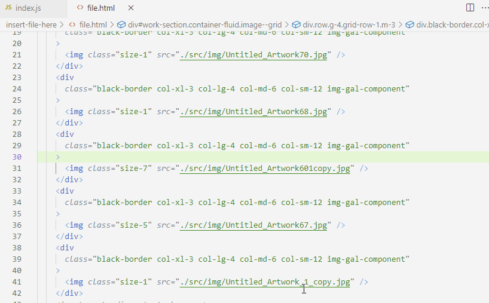

                
# Html File Editor

## Table of Contents 

* [Demonstration](#Demonstration)

* [Description](#Description)

* [Installation](#installation)
* [Usage](#usage)
* [Tests](#tests)
* [Questions](#questions)

* [License](#license)

## Demonstration

 

## Description

Tool for front-end development intended for static HTML that replaces random elements, but keeps all the attributes, and also replaces elements for fully responsive <picture> elements with all the necessary <source> inside to have multiple image formats and breakpoints. Also it embeds image-sharp-responsive that edits original image files and outputs multiple sizes, formats and appends size suffix to the filenames

## Technologies

<ul><li>Vanilla Javascript</li><li> Asynchronous Operations</li><li> Node</li></ul>
              
## Installation 
 To install necessary dependencies, run the following command: 'npm i'                   

## Usage 
 Run "npm run object" for a quick objet based input in the file ./index.js. Run "npm run inquirer" to input instructions through Inquirer CLI. 

## Tests 
 To run tests, run the following command: 'npm run test'

undefined

## Questions 
 If you have any questions write to cmontenegro.net@gmail.com, for issues please go to github.com/cristianmontenegrop/html-editor/issues

## License

This project is licensed under the AGPLv3 license.

                    